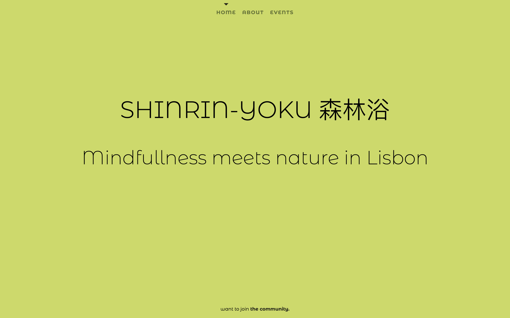
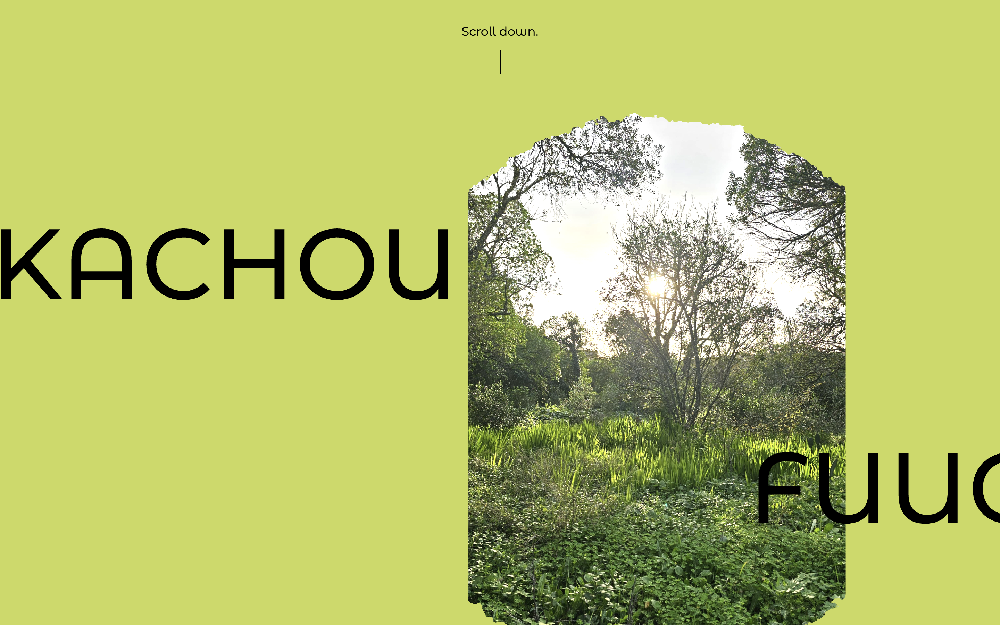
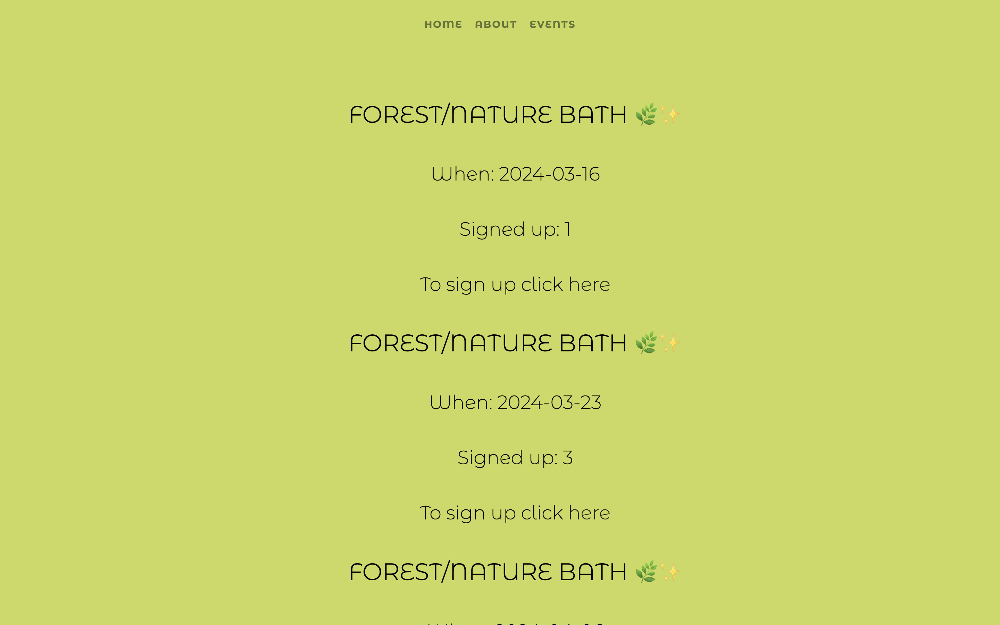

# Shinrin-yoku

## Objective 

In this project I combine two things on the one hand I want to create a  webpage using Svelte and on the other hand as I'm offering Shinrin-yoku (forest bathing) in Lisbon, I would like to offer the general information in the webapge format. 

## Structure 

As a template I use SvelteKit and the page route concept included in the component header. Contentwise the page offeres 3 layers: 

### Home 

Langing page and general information and desgin plus links. 

**to do** 

- adding whatsicon to join group instead of github 
- check similar webpages what they usally show in the home

### About 

Explanation of some of the main terms and their meaning put into images. 

**to do** 

- general explanation text about forst bathing
- fixing style changes that happened when integrating in the svelte page.  
- choose images and term to explain 
- check how to integrate more images
 
### Events 

General description of the events as well as showing current events thtough API. 

**to do** 

- Add a general event description from the meet-up page 
- change style of current event information shown 

Made with :green_heart:  by [sandraviz](https://www.sandraviz.com/)

Follow me: [twitter](https://twitter.com/SandraCrypto), [vis.social](https://vis.social/@sb_42), [linkedin](https://www.linkedin.com/in/sandradataviz/) and  [youtube](https://www.youtube.com/@sandraviz3403)
